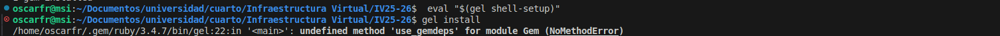

# DOCUMENTACIÓN DE GESTORES:

En los proyectos siempre hay una serie de tareas que se llevan a cabo de forma muy repetitiva, aquí es donde entran los gestores, estos son los encargados de gestionar y realizar estas actividades tan repetitivas. Pero antes de esto se necesita haber escogído el lenguaje , porque cada lenguaje dispone de diferentes opciones en gestores.

Para ello tenemos que partir del lenguaje escogido para este proyecto el cual es **ruby**.

## JUSTIFICACIÓN DEL LENGUAJE:

Para elegir el lenguaje del problema se tuvo en cuenta una serie de lenguajes, entre ellos se comentaron en clase go, typescript, ruby y a parte me llamó la curiosidad Kotlin. Tanto go como typescript fueron descartados debido a que otros compañeros ya lo habían elegido antes, dejando las opciones de ruby y kotlin.

**Kotlin**  era mi idea principal para su uso pero tras largas conversaciones con JJ entendí que al ser de la JVM al igual que java acarrearía el problema de  que los conceptos vistos en la asignatura difieren bastante de como se trabaja en kotlin. Por tanto esto le añadiría un plus de dificultad a la superación en los objetivos. AUnque también al usarlo la experiencia que ganaríamos sería muy buena ya que kotlin es un lenguaje muy usado, multiplataforma y teniendo una buenísima remuneración.

En cambio **Ruby** se asemeja a python, por tanto en cuanto al plus de dificultad de los conceptos se eliminaría, al ser tambien un lenguaje muy usado se dispone de una gran cantidad de documentación. Es un lenguaje con una curva de aprendizaje no muy grande y añadiendole que en la carrera se usa, quitaríamos esa necesidad de aprender desde cero, dejando más tiempo para trabajar los conceptos propuestos de la asignatura.

Tras debatir los pros y contras en un Issue con mi compañero Gabriel Francisco nos decidímos por ruby.

Una vez elegido el lenguaje hay que centrarse en que versión instalar para desplegar la aplicación, en un proyecto es recomendable probar distintas versiones del lenguaje para comprobar que no tenemos problemas en las distintas versiones, aunque a la hora de trabajar usaremos la última versión estable. Aquí es donde entra el **gestor de versiones**.

## GESTOR DE VERSIONES.

El gestor de versiones nos permite tener varias versiones de un mismo lenguaje en la misma máquina podiendo variar entre ellas gracias a él.

Para trabajar con **ruby** a la hora de elegir un gestor de versiones me he fijado en : **rbenv** que es el estandar moderno, **RVM** que es el clásico y **rv** una nueva herramienta todo en uno aunque actualmente solo gestiona versiones. Vamos a fijarnos en la velocidad para quedarnos con una:

Rbenv es mucho más rápido que RVM, ya que Rbenv sigue la idea de "hacer una sola cosa bien" haciendolo una herramienta menos pesada, mientras que RVM es una herramienta todo en uno siendo muy pesada. Teniendo en cuenta que Rbenv es más rápida que RVM, rv en su repositorio demuestra que es más rápida que Rbenv con un benchmark.

Teniendo en cuenta todo esto me he decidido por utilizar rv.

### INSTALACIÓN Y USO 
he usado la información de su [repositorio](https://github.com/spinel-coop/rv?tab=readme-ov-file#install-benchmark).

### BIBLIOGRAFÍA
He usado dos referencias de comparaciones entre **rvenb y RVM**.
- [Link 1](https://dev.to/lovestaco/rbenv-vs-rvm-picking-your-ruby-version-manager-buddy-4130#:~:text=If%20you%20want%20an%20all,RVM%20is%20a%20solid%20pick.).
- [Link 2](https://www.mindfiresolutions.com/blog/2018/01/rbenv-vs-rvm/)

En todo proyecto se instalan una gran cantidad de bibliotecas ( en el caso de **ruby gems** ), estas bibliotecas tienen versiones y dependencias, con las que hay que tratar y se tienen que instalar de la mejor forma. Para esto hay herramientas que se encargan de hacerlo **los gestores de dependencias**.

## GESTORES DE DEPENDENCIAS.

Un **gestor de dependencias** es el encargado de descargar, instalar y configurar software de terceros que tu proyecto necesita para funcionar, garantizando crear un entorno para que funcione el proyecto.

A la hora de elegir el gestor de dependencias en **ruby**, No hay una gran cantidad donde elegir , podemos hablar del estandar que es [Bundler](https://bundler.io/), [Gel](https://github.com/gel-rb/gel) y podemos mencionar a [rv](https://github.com/spinel-coop/rv), que actualmente en la fecha de realización de este proyecto, es solo un gestor de versiones pero en un futuro promete ser una herramienta todo en uno, muy a tener en cuenta.

Para el gestor de dependencias vamos a usar como Criterio la última vez que se actualizó, una herramienta desactualizada acarreará problemas para gestionar dependencias en las versiones nuevas del lenguaje, Bundler se actualizó por última vez el [3 de diciembre de 2025](https://rubygems.org/gems/bundler/versions?locale=es), mientras que Gel en [2022](https://rubygems.org/gems/gel/versions/0.3.0). Un ejemplo de problema que acarrea Gel es que para gestionar las dependencias de versiones nuevas no funciona:

Por tanto nos quedamos con el estandar Bundler.

### INSTALACIÓN Y USO
- Para instalarlo y usarlo he usado [la guia oficial](https://bundler.io/).

En cualquier proyecto nos encontramos con el problema de que existen tareas que se repiten como son ejecutar los test, compilar, limpiar archivos temporales, es aquí donde entran los **gestores de tareas**

## GESTORES DE TAREAS
Un **gestor de tareas** es el encargado de ralizar estas tareas tan repetitivas, estas operaciones se definen en un fichero, permitiendo que se ejecuten con un simple comando.

En ruby existen varias opciones en gestores de tareas, **como son Rake, Bake, Task, Just y Make**, a la hora de elegir me he centrado en una herramienta que esté integrada en el ecosistema ruby como son Rake y Bake, ambas cumplen el criterio pero me he decantado por **Rake** por ser el estandar.

### INSTALACION Y USO.

#### INSTALACIÓN
De cara a la instalación al ser **rake una gema**, podemos usar **bundler**, alteraríamos el **Gemfile** añadiendo la linea:

>gem "rake"

Y ejecutamos el comando para instalarlo:

>bundle install

Para este apartado se han usado el comando de [bundler](https://bundler.io/v2.7/man/bundle-install.1.html)

### USO

Para ello tenemos que crear un Rakefile, yo para crearlo he seguido estas guias:
    - [Rakefile Format](https://ruby.github.io/rake/doc/rakefile_rdoc.html#label-Deprecated+Task+Parameters+Format).
    - [Rake and Project Automatomatitation](https://graceful.dev/courses/the-freebies/modules/rake-and-project-automation/).
    - [What us Rake In Ruby y How To Use it](https://www.rubyguides.com/2019/02/ruby-rake/).

Y ejecutarlo junto a bundler para tener en cuenta las dependencias:

>bundle exec rake < Opcional: nombre de tarea>

Todos las opciones de comandos de Rake vienen [aquí](https://ruby.github.io/rake/doc/command_line_usage_rdoc.html).

### BIBLIOGRAFÍA
- [Link Documentación Rake](https://ruby.github.io/rake/).

