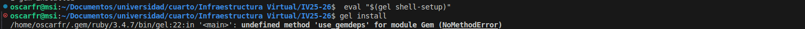

# DOCUMENTACIÓN DE GESTORES:

En los proyectos siempre hay una serie de tareas que se llevan a cabo de forma muy repetitiva, aquí es donde entran los gestores, estos son los encargados de gestionar y realizar estas actividades tan repetitivas. Pero antes de esto se necesita haber escogído el lenguaje, porque cada lenguaje dispone de diferentes opciones en gestores.

Para ello tenemos que partir del lenguaje escogido para este proyecto el cual es **ruby**.

En todo proyecto se instalan una gran cantidad de bibliotecas (en el caso de **ruby gems**), estas bibliotecas tienen versiones y dependencias, con las que hay que tratar y se tienen que instalar de la mejor forma. Para esto hay herramientas que se encargan de hacerlo **los gestores de dependencias**.

## GESTORES DE DEPENDENCIAS.

Un **gestor de dependencias** es el encargado de descargar, instalar y configurar software de terceros que tu proyecto necesita para funcionar, garantizando crear un entorno para que funcione el proyecto.

En **ruby** existe un estandar para especificar las dependencias, este estandar es el archivo [Gemfile](https://tosbourn.com/what-is-the-gemfile/). En el se pude especificar lo siguiente:
- Definir la fuente de donde va a obtener las gemas.
- Las gemas necesarias para el proyecto junto a su versión.
- Se pueden agrupar la gemas por grupos.
- Instalar las gemas desde Git o desde un path local.
- Especificar condiciones para instalar las gemas.

A la hora de elegir el gestor de dependencias en **ruby**, no hay una gran cantidad donde elegir, podemos hablar de [Bundler](https://bundler.io/), el cual viene instalado por defecto en las versiones modernas de **ruby** siendo el [estandar de facto](https://www.ruby-toolbox.com/categories/dependency_management) y usa el estandar para especificar las dependencias. [Gel](https://github.com/gel-rb/gel) que es una gem de ruby, habría que instalarlo con el gestor de paquetes de **ruby** y también usa el estandar para especificar las dependencias. Podemos mencionar a [rv](https://github.com/spinel-coop/rv), que actualmente en la fecha de realización de este proyecto, es solo un gestor de versiones pero en un futuro promete ser una herramienta todo en uno, muy a tener en cuenta, habría que instalarlo desde su repositorio y se desconoce si usará el estandar para especificar las herramientas.

Para el gestor de dependencias vamos a usar como Criterio la última vez que se actualizó, una herramienta desactualizada acarreará problemas para gestionar dependencias en las versiones nuevas del lenguaje, Bundler se actualizó por última vez el [3 de diciembre de 2025](https://rubygems.org/gems/bundler/versions?locale=es), mientras que Gel en [2022](https://rubygems.org/gems/gel/versions/0.3.0). Un ejemplo de problema que acarrea Gel es que para gestionar las dependencias de versiones nuevas no funciona:

Por tanto nos quedamos con el estandar de facto Bundler.

En cualquier proyecto nos encontramos con el problema de que existen tareas que se repiten como son ejecutar los test, compilar, limpiar archivos temporales, es aquí donde entran los **gestores de tareas**

## GESTORES DE TAREAS
Un **gestor de tareas** es el encargado de realizar estas tareas tan repetitivas, estas operaciones se definen en un fichero, permitiendo que se ejecuten con un simple comando.

Como criterio para elegir establecemos que la herramienta que vamos a usar esté integrada en el ecosistema ruby y dentro de esas herramientas nos quedaremos con el estandar de facto.

En ruby existen varias opciones en gestores de tareas, podemos hablar de herramientas integradas en el ecosistema Ruby como son [Rake](https://ruby.github.io/rake/) siendo una gema de ruby, la cual podríamos instalar con Bundler y es actualmente el [estandar de facto](https://www.ruby-toolbox.com/projects/rake) al ser la herramienta más dominante y usada en cuanto a gestores de tareas en ruby, [Bake](https://ioquatix.github.io/bake/) es otra gema la cual puede ser intalada tambien con Bundler. Herramientas externas al ecosistema ruby como son [Task](https://taskfile.dev/) y [Just](https://github.com/casey/just) que son herramientas  multiplataforma insparada en Make y por último [Make](https://www.gnu.org/software/make/manual/make.html) el estandar actual de linux viniendo instalada por defecto en todas las distribuciones de linux. 

Siguiendo el criterio de que la herramienta esté integrada en el ecosistema de ruby, descartaría tanto a Just, Task y Make que son herramientas externas. Y nos dejaría a Bake y Rake ambas cumplen la condición de estar integradas en el ecosistema ruby, siendo gems del propio lenguaje, pero para quedarnos con una usamos el criterio del estandar de facto el cual es Rake.

