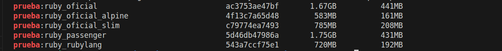

# JUSTIFICACIÓN DE LA ELECCIÓN DE LA IMAGEN BASE 

## CRITERIOS DE LA ELECCIÓN DE LA IMAGEN BASE 

Se establecen como criterios para la elección de la imagen base del contenedor de testeo de la aplicación los siguientes:

- **Permita usar el gestor de dependencias Bundler**: Es necesario que la imagen permita el uso de Bundler ya que es el encargado de instalar las dependencias del proyecto en el entorno de pruebas.

- **Permita usar el gestor de tareas Rake**: Es necesario que la imagen permita el uso de Rake ya que es el encargado de ejecutar las tareas de testeo de la aplicación.

- **Tamaño**: Se evaluará el tamaño final de la imagen base con la infraestructura de testeo, buscando una imagen que sea lo más ligera posible completa, ya que hay muchas imágenes que pueden ser muy ligeras pero no incluyen las herramientas necesarias para el testeo de la aplicación, lo que podría requerir la instalación de paquetes adicionales y aumentar el tamaño final de la imagen.

- **Seguridad**: Buscamos una imagen actualizada y mantenida regularmente para minimizar las vulnerabilidades, priorizando aquellas que tienen un menor número de vulnerabilidades. Para esto se usará la herramienta de análisis de vulnerabilidades Snyk, que nos permitirá evaluar y comparar las imágenes candidatas en términos de seguridad.

## IMAǴENES BASE EVALUADAS:

### Imágenes Oficiales(Mantenidas por Docker):
La documentación de estas imágenes oficiales se encuentra en este [enlace](https://hub.docker.com/_/ruby).

- **ruby**: se trata de la imagen por defecto es un sistema linux completo basado en debian. Al tratarse de un sistema completo su tamaño de base es elevado.

- **ruby:slim**: es una versión reducida de la imagen oficial, es la misma base que la anterior pero se eliminan manuales, documentación y paquetes extra para reducir su tamaño.

- **ruby:alpine**: esta versión usa Alpine Linux como base, esta diseñada específicamente para contenedores y en lugar de usar glibc usa musl, esto hace que se reduzca bastante el tamaño. Aunque al usar musl puede provocar problemas de compatibilidad con algunas gemas que esperan glibc.

- **rubylang/ruby**: Imagen mantenida por los propios desarrolladores de Ruby y su comunidad. Esta  basada en ubuntu y ofrece ventajas en tamaño base frente a la oficial. [Documentación](https://hub.docker.com/r/rubylang/ruby/). 

### Imágenes no oficiales (Creadas por empresas o proyectos de la comunidad):

- **openeuler/distroless-ruby:<version>**: Esta imagen sigue la filosofía del proyecto [Distroless](https://github.com/GoogleContainerTools/distroless) de google pero es mantenida por la comunidad de openeuler. Las imágenes distroless están diseñadas para contener solo la aplicación y sus dependencias, sin incluir un sistema operativo completo. Esto reduce significativamente el tamaño de la imagen y minimiza la superficie de ataque, ya que no hay shell ni herramientas adicionales que puedan ser explotadas. [Documentación](https://hub.docker.com/r/openeuler/distroless-ruby).

- **phusion/passenger-ruby**: Imagen mantenida por Phusion. Esta imagen es al contrario que la anterior es una imagen todo en uno, incluyendo un sistema operativo basado en ubuntu junto a un servidor web. Esto hace que el tamaño de la imagen sea elevado, aunque incluye muchas herramientas útiles para el desarrollo y testeo de aplicaciones Ruby. [Documentación](https://github.com/phusion/passenger-docker).

## EVALUACIÓN DE LAS IMÁGENES BASE

### Aplicando los criterios de que permita usar Bundler y Rake:

- **ruby**: Permite usar Bundler y Rake, ya que es una imagen completa basada en Debian que incluye un sistema operativo completo con todas las herramientas necesarias para el desarrollo y testeo de aplicaciones Ruby.
- **ruby:slim**: Permite usar Bundler y Rake, ya que es una versión reducida de la imagen oficial pero sigue incluyendo las herramientas necesarias para el desarrollo y testeo de aplicaciones Ruby.
- **ruby:alpine**: Permite usar Bundler y Rake, aunque al usar musl en lugar de glibc puede provocar problemas de compatibilidad con algunas gemas que esperan glibc, lo que podría dificultar el uso de Bundler y Rake en algunos casos.
- **rubylang/ruby**: Permite usar Bundler y Rake, ya que es una imagen basada en Ubuntu que incluye un sistema operativo completo con todas las herramientas necesarias para el desarrollo y testeo de aplicaciones Ruby.
- **openeuler/distroless-ruby**: No permite usar Bundler y Rake, ya que es una imagen distroless diseñada para contener solo la aplicación y sus dependencias, sin incluir un sistema operativo completo ni herramientas adicionales.
- **phusion/passenger-ruby**: Permite usar Bundler y Rake, ya que es una imagen todo en uno que incluye un sistema operativo basado en Ubuntu junto a un servidor web, lo que proporciona todas las herramientas necesarias para el desarrollo y testeo de aplicaciones Ruby.   

Se descarta la imagen **openeuler/distroless-ruby** ya que no permite usar Bundler y Rake, lo que es un requisito fundamental para el testeo de la aplicación, ya que son necesarios para instalar las dependencias y ejecutar las tareas de testeo de la aplicación.

### Aplicando el criterio del tamaño:
Siguiendo el criterio del tamaño se evalua el tamaño de las imágenes candidatas con la infraestructura de testeo buscando la imagen más ligera.
Como resultado de esta evaluación se obtiene los siguientes tamaños finales de las imágenes candidatas:

Como se puede observar en la imagen anterior con los resultados, la imagen de menor tamaño es la imagen oficial de ruby:alpine, seguida de la imagen rubylang/ruby y la imagen slim. Y las imágenes con mayor tamaño son la imagen phusion/passenger-ruby y la imagen oficial de ruby como era de esperar, ya que incluyen un sistema operativo completo y muchas herramientas adicionales.

